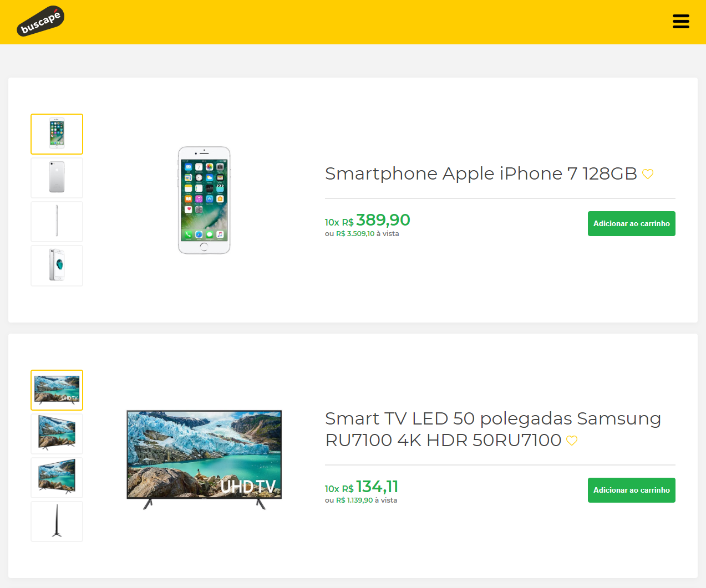
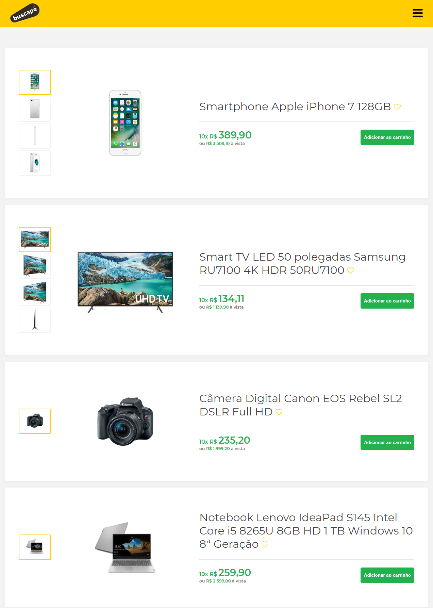
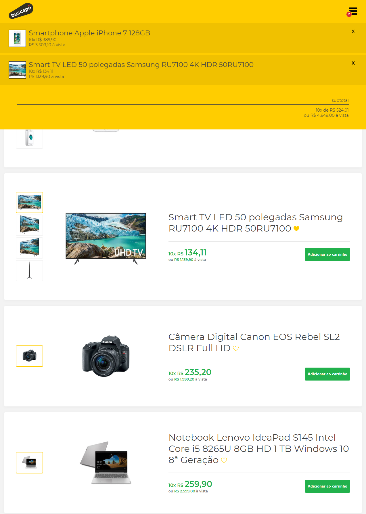
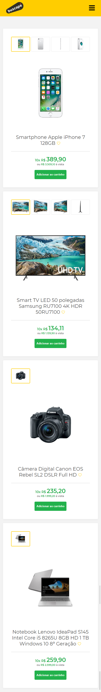
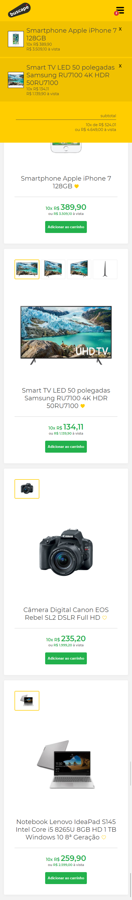

<h1 align="center">
    
</h1>

  
   
  

  

  

  <a href="#-sobre-o-projeto">Sobre o projeto</a>&nbsp;&nbsp;&nbsp;|&nbsp;&nbsp;&nbsp;
  <a href="#-tecnologias">Tecnologias</a>&nbsp;&nbsp;&nbsp;|&nbsp;&nbsp;&nbsp;
  <a href="#-layout">Layout</a>&nbsp;&nbsp;&nbsp;|&nbsp;&nbsp;&nbsp;
  <a href="#-projeto-final">Projeto final</a>

 

  

## 💻 Sobre o projeto

Esse projeto foi desenvolvido com a finalidade de praticar meus conhecimentos com o JavaScript. Trata-se de um clone simples do [Buscapé](https://www.buscape.com.br/), que simula a listagem de 4 produtos por meio de um fetch, uma navegação de imagens e a funcionalidade de adicionar e remover do carrinho. Além disso, o código em si foi feito com base em Classes, a fim de exercitar a Orientação a Objetos.

## 🚀 Tecnologias

Esse projeto foi desenvolvido com as seguintes tecnologias:

- [JavaScript ES6](https://developer.mozilla.org/pt-BR/docs/Web/JavaScript)
- [CSS3](https://developer.mozilla.org/pt-BR/docs/Web/CSS)
- [HTML5](https://developer.mozilla.org/pt-BR/docs/Web/HTML)

## 🔖 Layout

O layout e o desafio foram tirados do repositório [Front-end Challenges](https://github.com/felipefialho/frontend-challenges), do [Felipe Fialho](https://github.com/felipefialho/).

## 🌐 Projeto final
[Clique aqui](https://vilsonsampaio.github.io/buscape-challenge) para acessar o projeto no ar!

### 🖥 Desktop
#### Página principal

#### Página principal (carrinho aberto)

 

### 📱 Mobile
#### Página principal

#### Página principal (carrinho aberto)

---

Feito com ❤️ by <a href="https://www.linkedin.com/in/vilsonsampaio/">Vilson Sampaio</a>

